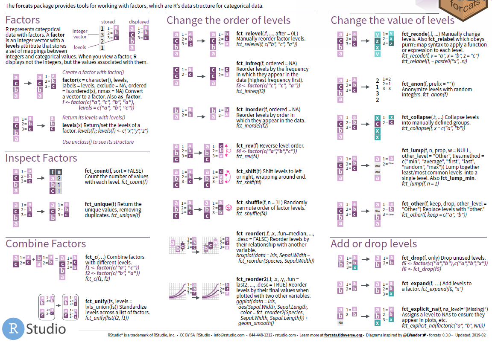
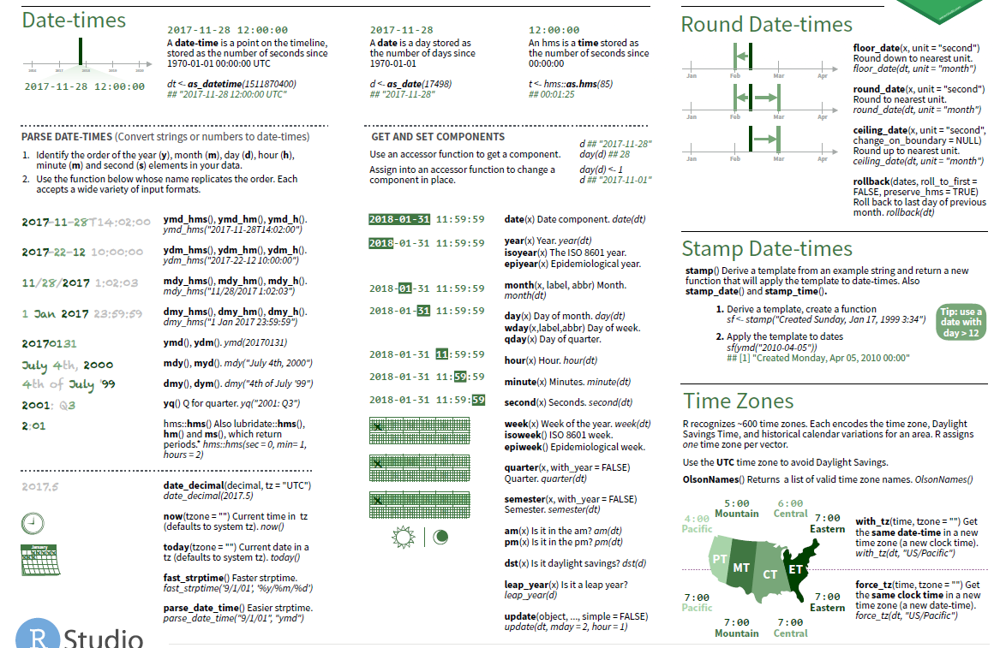

# Data Management using R

## Basis System Seeting

### Help and Packages

* Tools Global Options
  * `getwd()`
  * `setwd("C:/.../")`
* Source: http://r-project.org
* Install and load Packages
  * `install.packages()`
  * `library()`
  * `library(help="pwr")`
  * Releasing loaded packages: `detach(package:pwr)`
  * `remove.packages("pwr")`
  * List all already installed packages: `library()`
* Help system
  * Opens the (web) links to the manuals. `help.start()`
  * Access help for specific functions
    * `?sqrt`
    * `help(sqrt)`
    * `help("sqrt")`
  * `apropos("mean")` returns a list of function names that contain the expression mean (**functions displayed in the loaded packages.**)
  * `help(glm, try.all.packages=T)` searches in all installed packages and returns the names of these packages. The help page for a function in a package that has not yet been loaded can then be displayed using the package option.
  * Alternative `help(glm, package="stats")`
  * `help.search("truncated")` or `??truncated` searches for a specific word (here truncated) in the online help.
  * `RSiteSearch("truncated")` searches help pages, vignettes and task views for the keyword “truncated”.
 
### Create Script

* Save a collection of R commands in a text file (R script) with the file extension ".R". 
* R-Studio: File- New File - R Script
* Comment
  * hash symbol
  * <!--  --> in R markdown

### Basic Mathematische Operatoren & Funktionen

```{r, echo=FALSE, fig.align="center", out.width = '100%',fig.cap="Basic Mathematische Operatoren & Funktionen A"}
knitr::include_graphics("./02_Plots/02_Math_A.png") 
```

```{r, echo=FALSE, fig.align="center", out.width = '100%',fig.cap="Basic Mathematische Operatoren & Funktionen B"}
knitr::include_graphics("./02_Plots/02_Math_B.png") 
```


```
5 !=2+2
TRUE & FALSE
TRUE | FALSE
(4>= 3|5==6) & (4!=4)
FALSE || (2 !=3)
7%/%2
18%%3
Inf + Inf + 2
Inf - Inf + 2
5/0

x <- 1:7
(x > 2) && (x < 5)
(x > 2) | (x < 5)
(x > 2) || (x < 5)
```


## Data Type in R

R has 6 basic data types. (In addition to the five listed below, there is also raw which will not be discussed in this workshop.)

* character
* numeric (real or decimal)
* integer
* logical
* complex

Data structures are very important to understand because these are the objects you
will manipulate on a day-to-day basis in R. Dealing with object conversions is one
of the most common sources of frustration for beginners.

**Everything** in R is an object.

R has 6 basic data types. (In addition to the five listed below, there is also
*raw* which will not be discussed in this workshop.)

- character
- numeric (real or decimal)
- integer
- logical
- complex

Elements of these data types may be combined to form data structures, such as
atomic vectors. When we call a vector *atomic*, we mean that the vector only
holds data of a single data type. Below are examples of atomic character vectors,
numeric vectors, integer vectors, etc.

- **character**: `"a"`, `"swc"`
- **numeric**: `2`, `15.5`
- **integer**: `2L` (the `L` tells R to store this as an integer)
- **logical**: `TRUE`, `FALSE`
- **complex**: `1+4i` (complex numbers with real and imaginary parts)

R provides many functions to examine features of vectors and other objects, for
example

- `class()` - what kind of object is it (high-level)?
- `typeof()` - what is the object's data type (low-level)?
- `length()` - how long is it? What about two dimensional objects?
- `attributes()` - does it have any metadata?

```{r}
# Example
x <- "dataset"
typeof(x)
attributes(x)

y <- 1:10
y
typeof(y)
length(y)

z <- as.numeric(y)
z
typeof(z)
```

R has many **data structures**. These include

- atomic vector
- list
- matrix
- data frame
- factors

## Data Structure in R

 
### Vectors

A vector is the most common and basic data structure in R and is pretty much the
workhorse of R. Technically, vectors can be one of two types:

- atomic vectors
- lists

although the term "vector" most commonly refers to the atomic types not to lists.

#### The Different Vector Modes

A vector is a collection of elements that are most commonly of mode `character`,
`logical`, `integer` or `numeric`.

You can create an empty vector with `vector()`. (By default the mode is
`logical`. You can be more explicit as shown in the examples below.) It is more
common to use direct constructors such as `character()`, `numeric()`, etc.

```{r}
vector() # an empty 'logical' (the default) vector
vector("character", length = 5) # a vector of mode 'character' with 5 elements
character(5) # the same thing, but using the constructor directly
numeric(5)   # a numeric vector with 5 elements
logical(5)   # a logical vector with 5 elements
```

You can also create vectors by directly specifying their content. R will then
guess the appropriate mode of storage for the vector. For instance:

```{r}
x <- c(1, 2, 3)
```

will create a vector `x` of mode `numeric`. These are the most common kind, and
are treated as double precision real numbers. If you wanted to explicitly create
integers, you need to add an `L` to each element (or *coerce* to the integer
type using `as.integer()`).

```{r}
x1 <- c(1L, 2L, 3L)
```

Using `TRUE` and `FALSE` will create a vector of mode `logical`:

```{r}
y <- c(TRUE, TRUE, FALSE, FALSE)
```

While using quoted text will create a vector of mode `character`:

```{r}
z <- c("Sarah", "Tracy", "Jon")
```

#### Examining Vectors

The functions `typeof()`, `length()`, `class()` and `str()` provide useful
information about your vectors and R objects in general.

```{r}
typeof(z)
length(z)
class(z)
str(z)
```

#### Adding Elements

The function `c()` (for combine) can also be used to add elements to a vector.

```{r}
z <- c(z, "Annette")
z
z <- c("Greg", z)
z
```

#### Vectors from a Sequence of Numbers

You can create vectors as a sequence of numbers.

```{r}
series <- 1:10
seq(10)
seq(from = 1, to = 10, by = 0.1)
```

#### Missing Data

R supports missing data in vectors. They are represented as `NA` (Not Available)
and can be used for all the vector types covered in this lesson:

```{r}
x <- c(0.5, NA, 0.7)
x <- c(TRUE, FALSE, NA)
x <- c("a", NA, "c", "d", "e")
x <- c(1+5i, 2-3i, NA)
```

The function `is.na()` indicates the elements of the vectors that represent
missing data, and the function `anyNA()` returns `TRUE` if the vector contains
any missing values:

```{r}
x <- c("a", NA, "c", "d", NA)
y <- c("a", "b", "c", "d", "e")
is.na(x)
is.na(y)
anyNA(x)
anyNA(y)
```

#### Other Special Values

`Inf` is infinity. You can have either positive or negative infinity.

```{r}
1/0
```

`NaN` means Not a Number. It's an undefined value.

```{r}
0/0
```

#### What Happens When You Mix Types Inside a Vector?

R will create a resulting vector with a mode that can most easily accommodate
all the elements it contains. This conversion between modes of storage is called
"coercion". When R converts the mode of storage based on its content, it is
referred to as "implicit coercion". For instance, can you guess what the
following do (without running them first)?

```{r}
xx <- c(1.7, "a")
xx <- c(TRUE, 2)
xx <- c("a", TRUE)
```

You can also control how vectors are coerced explicitly using the
`as.<class_name>()` functions:

```{r}
as.numeric("1")
as.character(1:2)
```

### Matrix
 
In R matrices are an extension of the numeric or character vectors. They are not
a separate type of object but simply an atomic vector with dimensions; the
number of rows and columns. As with atomic vectors, the elements of a matrix must
be of the same data type.

```{r}
m <- matrix(nrow = 2, ncol = 2)
m
dim(m)
```

You can check that matrices are vectors with a class attribute of `matrix` by using
`class()` and `typeof()`.

```{r}
m <- matrix(c(1:3))
class(m)
typeof(m)
```

While `class()` shows that m is a matrix, `typeof()` shows that fundamentally the
matrix is an integer vector.
 
Matrices in R are filled column-wise.

```{r}
m <- matrix(1:6, nrow = 2, ncol = 3)
```

Other ways to construct a matrix

```{r}
m      <- 1:10
dim(m) <- c(2, 5)
```

This takes a vector and transforms it into a matrix with 2 rows and 5 columns.

Another way is to bind columns or rows using `rbind()` and `cbind()` ("row bind"
and "column bind", respectively).

```{r}
x <- 1:3
y <- 10:12
cbind(x, y)
rbind(x, y)
```

You can also use the `byrow` argument to specify how the matrix is filled.
From R's own documentation:

```{r}
mdat <- matrix(c(1, 2, 3, 11, 12, 13),
               nrow = 2,
               ncol = 3,
               byrow = TRUE)
mdat
```

Elements of a matrix can be referenced by specifying the index along each
dimension (e.g. "row" and "column") in single square brackets.

```{r}
mdat[2, 3]
```

### List

In R lists act as containers. Unlike atomic vectors, the contents of a list are
not restricted to a single mode and can encompass any mixture of data
types. Lists are sometimes called generic vectors, because the elements of a
list can by of any type of R object, even lists containing further lists. This
property makes them fundamentally different from atomic vectors.

A list is a special type of vector. Each element can be a different type.

Create lists using `list()` or coerce other objects using `as.list()`. An empty
list of the required length can be created using `vector()`

```{r}
x <- list(1, "a", TRUE, 1+4i)
x

x <- vector("list", length = 5) # empty list
length(x)
```

The content of elements of a list can be retrieved by using double square brackets.

```{r}
x[[1]]
```

Vectors can be coerced to lists as follows:

```{r}
x <- 1:10
x <- as.list(x)
length(x)
```
 
Lists can be extremely useful inside functions. Because the functions in R are
able to return only a single object, you can "staple" together lots of different
kinds of results into a single object that a function can return.

A list does not print to the console like a vector. Instead, each element of the
list starts on a new line.

Elements are indexed by double brackets. Single brackets will still return
a(nother) list. If the elements of a list are named, they can be referenced by
the `$` notation (i.e. `xlist$data`).

### Data Frame

A data frame is a very important data type in R. It's pretty much the *de facto*
data structure for most tabular data and what we use for statistics.

A data frame is a *special type of list* where every element of the list has same
length (i.e. data frame is a "rectangular" list).

Data frames can have additional attributes such as `rownames()`, which can be
useful for annotating data, like `subject_id` or `sample_id`. But most of the
time they are not used.

Some additional information on data frames:

- Usually created by `read.csv()` and `read.table()`, i.e. when importing the data into R.
- Assuming all columns in a data frame are of same type, data frame can be converted to a matrix with data.matrix() (preferred) or as.matrix(). Otherwise type coercion will be enforced and the results may not always be what you expect.
- Can also create a new data frame with `data.frame()` function.
- Find the number of rows and columns with `nrow(dat)` and `ncol(dat)`, respectively.
- Rownames are often automatically generated and look like 1, 2, ..., n. Consistency in numbering of rownames may not be honored when rows are reshuffled or subset.

#### Creating Data Frames by Hand

To create data frames by hand:

```{r}
dat <- data.frame(id = letters[1:10], x = 1:10, y = 11:20)
dat
```
 
#### Useful Data Frame Functions

- `head()` - shows first 6 rows
- `tail()` - shows last 6 rows
- `dim()` - returns the dimensions of data frame (i.e. number of rows and number of columns)
- `nrow()` - number of rows
- `ncol()` - number of columns
- `str()` - structure of data frame - name, type and preview of data in each column
- `names()` or `colnames()` - both show the `names` attribute for a data frame
- `sapply(dataframe, class)` - shows the class of each column in the data frame 


The following table summarizes the one-dimensional and two-dimensional data structures in
R in relation to diversity of data types they can contain.

| Dimensions | Homogenous    | Heterogeneous | 
| ---------- | ------------- | ------------- |
| 1-D        | atomic vector | list          | 
| 2-D        | matrix        | data frame    | 

Lists can contain elements that are themselves muti-dimensional (e.g. a lists can contain
data frames or another type of objects). Lists can also contain elements of any length,
therefore list do not necessarily have to be "rectangular". However in order for the list
to qualify as a data frame, the length of each element has to be the same.


## Function in R

```
my.fun <- function(x1 ,x2) (x1 + x2)/2 # order
my.fun <- function(x1 ,x2){
(x1 + x2)/2
} # order
my.fun <- function(x1 ,x2){
y <- (x1 + x2)/2
y
}# order
my.fun <- function(x1 ,x2){
y <- (x1 + x2)/2
return(y)
}

# Calling the function:
my.fun(100, 200) # order
my.fun(x1 = 100, x2 = 200) # order
my.fun(x2 = 200, x1 = 100)
```


## Load Data


 

### Package readr 


```{r readr, echo=FALSE, fig.align="center", out.width = '100%',fig.cap="Data Import: CHEAT SHEET"}
knitr::include_graphics("./02_Plots/readr_sheet1.png") 
knitr::include_graphics("./02_Plots/readr_sheet2.png") 
```


### Import csv data

The Scan function returns a **list or vector**. This makes the scanning function less useful for entering "rectangular" data

```
mydata1 <- read.csv("~/Desktop/SASUniversityEdition/myfolders/Daten/CRP.csv",
                    sep=";", 
                    header=TRUE)   
mydata2 <- scan("~/Desktop/SASUniversityEdition/myfolders/Daten/CRP.csv", 
                sep=";", 
                what = list("integer","numeric"))
```

### Import txt data

```
test.semi <- read.table("https://stats.idre.ucla.edu/wp-content/uploads/2016/02/testsemicolon.txt", header=T, sep=";")
print(test.semi)

pfad <- "~/Desktop/SASUniversityEdition/myfolders/Daten"
mydata3 <- read.table(file.path(pfad, "CRP.csv"), 
                      header=TRUE, sep=";", dec = ",", skip=9) 
```

### Import excel data

* read.xlsx slow for large data sets (worksheet with more than 100 000 cells)  
* read.xlsx2 is faster on big files compared to read.xlsx function.

```
## install.packages("xlsx")
library("xlsx")
read.xlsx(file, sheetIndex, header=TRUE, colClasses=NA)
read.xlsx2(file, sheetIndex, header=TRUE, colClasses="character")
```

### Import stata data

```
library(foreign)
test.stata <- read.dta("https://stats.idre.ucla.edu/stat/data/test.dta")
print(test.stata)
```

### Import SAS data

```
library(sas7bdat)
data <- read.sas7bdat("~/Desktop/SASUniversityEdition/myfolders/Daten/uis.sas7bdat")
View(data)
```

### Copy from clipboard

```
copdat <- read.delim("clipboard")
yourdata <- copdat 
```

### Save and write objective in R

#### Save as R-Datei

```
path <- "C:/Users/zbai/Projects/00_Project/00 PMS_VENUS/VENUS_CIR/01_Datasets"
saveRDS(save_objective, file = file.path(path, "dataname.rds" ))

save_objective <- readRDS(file = file.path(path, "dataname.rds" ))
```

#### write.table and write.csv

```
#  quote：字符串是否使用引号表示，默认为TRUE，也就是使用引号表示
#  row.names：是否导出行序号，默认为TRUE，也就是导出行序号 
#  col.names：是否导出列名，默认为TRUE，也就是导出列名 
#  sep：分隔符，默认为空格（” “），也就是以空格为分割列
write.table (data ,file ="~/Desktop/f.csv", row.names = FALSE, col.names =FALSE, quote =FALSE)
```

#### write.foreign

Save as SPSS- und SAS- Datei 

```
library("foreign")
datafile <- tempfile()
codefile <- tempfile()
write.foreign(esoph, datafile, codefile, package="SAS")
file.show(datafile)
file.show(codefile)
unlink(datafile)
unlink(codefile)
```

#### write.xlsx

```
# Write the first data set in a new workbook
write.xlsx(USArrests, file = "./01_Datasets/myworkbook.xlsx",
      sheetName = "USA-ARRESTS", append = FALSE)
# Add a second data set in a new worksheet
write.xlsx(mtcars, file = "myworkbook.xlsx", 
           sheetName="MTCARS", append=TRUE)
# Add a third data set
write.xlsx(iris, file = "myworkbook.xlsx",
           sheetName="IRIS", append=TRUE)
```


### Save the plot

File formats for exporting plots:

* pdf(“rplot.pdf”): pdf file
* png(“rplot.png”): png file
* jpeg(“rplot.jpg”): jpeg file
* postscript(“rplot.ps”): postscript file
* bmp(“rplot.bmp”): bmp file
* win.metafile(“rplot.wmf”): windows metafile

```
# 1. Open a pdf file
pdf("rplot.pdf") 
# 2. Create a plot
plot(x = my_data$wt, y = my_data$mpg,
     pch = 16, frame = FALSE,
     xlab = "wt", ylab = "mpg", col = "#2E9FDF")
# 3. Close the pdf file
dev.off() 
```


## Basic Data Management

### apply family


## Package tidyr 

### CHEAT SHEET

```{r tidyr-cheat-sheet, echo=FALSE, fig.align="center", out.width = '100%',fig.cap="Data Wrangling with dplyr and tidyr"}
knitr::include_graphics("./02_Plots/tidyr_sheet1.png")
knitr::include_graphics("./02_Plots/tidyr_sheet2.png")
```


### Pivoting

* One variable might be spread across multiple columns. 
* One observation might be scattered across multiple rows. 
    + `pivot_longer()`
    + `pivot_wider()`
    
```{r pivot_longer,echo = T,message = FALSE, error = FALSE, warning = FALSE}
library("tidyr")
table4a

table4a %>% 
  pivot_longer(c(`1999`, `2000`), names_to = "year", values_to = "cases")
```

```{r pivot_wider, echo = T,message = FALSE, error = FALSE, warning = FALSE}
table2

table2 %>%
    pivot_wider(names_from = type, values_from = count)


## missing values
## last observation carried forward
treatment <- tribble(
  ~ person,           ~ treatment, ~response,
  "Derrick Whitmore", 1,           7,
  NA,                 2,           10,
  NA,                 3,           9,
  "Katherine Burke",  1,           4
)

treatment %>% 
  fill(person)
```

### gather and spread


```{r gather spread,echo = T,message = FALSE, error = FALSE, warning = FALSE}
## prepare data
olddata_wide <- read.table(header=TRUE, text='
 subject sex control cond1 cond2
       1   M     7.9  12.3  10.7
       2   F     6.3  10.6  11.1
       3   F     9.5  13.1  13.8
       4   M    11.5  13.4  12.9
')
olddata_wide$subject <- factor(olddata_wide$subject)

olddata_long <- read.table(header=TRUE, text='
 subject sex condition measurement
       1   M   control         7.9
       1   M     cond1        12.3
       1   M     cond2        10.7
       2   F   control         6.3
       2   F     cond1        10.6
       2   F     cond2        11.1
       3   F   control         9.5
       3   F     cond1        13.1
       3   F     cond2        13.8
       4   M   control        11.5
       4   M     cond1        13.4
       4   M     cond2        12.9
')
olddata_long$subject <- factor(olddata_long$subject)

## factor_key将新键列视为一个因子（而不是字符向量）
data_long <- gather(olddata_wide, condition, measurement, control:cond2, factor_key=TRUE)

##########################################################
#                     Äquivalent                         #
keycol <- "condition"                                    #
valuecol <- "measurement"                                #
gathercols <- c("control", "cond1", "cond2")             #
gather_(olddata_wide, keycol, valuecol, gathercols)      #
##########################################################

data_wide <- spread(data=olddata_long, key = condition, value = measurement, convert = T)
data_wide %>% str
```

### separate and unite


```{r separate unite ,echo = T,message = FALSE, error = FALSE, warning = FALSE}
table3

table3 %>% 
  separate(rate, into = c("cases", "population"), sep = "/")

table3 %>% 
  separate(year, into = c("century", "year"), sep = 2)

table5 %>% 
  unite(new, century, year)

table5 %>% 
  unite(new, century, year, sep = "")
```


## Package dplyr 

[Package ‘dplyr’](https://cran.r-project.org/web/packages/dplyr/dplyr.pdf)

### CHEAT SHEET

```{r dplyr-cheat-sheet, echo=FALSE, fig.align="center", out.width = '100%',fig.cap="Data Transformation with dplyr"}
knitr::include_graphics("./02_Plots/data_transformation1.png")
knitr::include_graphics("./02_Plots/data_transformation2.png")
```


### across


```{r across function,echo = T,message = FALSE, error = FALSE, warning = FALSE}
library("dplyr")
iris %>%
    as_tibble() %>%
    mutate(across(c(Sepal.Length, Sepal.Width), round))
```

### arrange


```{r arrange function,echo = T,message = FALSE, error = FALSE, warning = FALSE}
## Missing values are always sorted at the end:
data("flights",package="nycflights13")
arrange(flights, year, month, day)

## in descending order:
arrange(flights, desc(dep_delay))

## group_by
by_cyl <- mtcars %>% group_by(cyl)    
## 无视之前的分组            
by_cyl %>% arrange(desc(wt))    
   
## 在之前的分组内再排序    
by_cyl %>% arrange(desc(wt), .by_group = TRUE) 
```

### coalesce

```{r coalesce function,echo = T,message = FALSE, error = FALSE, warning = FALSE}
# Or match together a complete vector from missing pieces
y <- c(1, 2, NA, NA, 5)
z <- c(NA, NA, 3, 4, 5)
coalesce(y, z)

# Supply lists by with dynamic dots
vecs <- list(
  c(1, 2, NA, NA, 5),
  c(NA, NA, 3, 4, 5)
)
coalesce(!!!vecs)
```

### filter

```{r filter function,echo = T,message = FALSE, error = FALSE, warning = FALSE}
data("flights",package="nycflights13")
filter(flights, month == 1, day == 1)
filter(flights, month == 11 | month == 12)
filter(flights, month %in% c(11, 12))    

## Missing values,use is.na(x)
df <-  tibble(x = c(1, NA, 3))
filter(df, is.na(x) | x > 1) 
```

### if_else


```{r if_else function,echo = T,message = FALSE, error = FALSE, warning = FALSE}
x <- factor(sample(letters[1:5], 10, replace = TRUE))
ifelse(x %in% c("a", "b", "c"), x, factor(NA))
## 与ifelse不同，if_else保留类型
if_else(x %in% c("a", "b", "c"), x, factor(NA))
```

### join


```{r join function,echo = T,message = FALSE, error = FALSE, warning = FALSE}
## left join: 共有
## full join: 全部
## left join: 以左边为主

## 选取变量 left join
data("flights",package="nycflights13")
data("airlines",package="nycflights13")
data("weather",package="nycflights13")

flights2 <- flights %>% 
  select(year:day, hour, origin, dest, tailnum, carrier)
head(flights2)  
```


### mutate

```{r mutate function,echo = T,message = FALSE, error = FALSE, warning = FALSE}
## mutate()
flights_sml <- select(flights, 
  year:day, 
  ends_with("delay"), 
  distance, 
  air_time
) 
```


### select

```{r select function,echo = T,message = FALSE, error = FALSE, warning = FALSE}
data("flights",package="nycflights13")
select(flights, year, month, day)
select(flights, year:day)
select(flights, -(year:day))

    ## 辅助函数 helper functions can use within select():
       ## starts_with("abc"): matches names that begin with “abc”.
       ## ends_with("xyz"): matches names that end with “xyz”.
       ## contains("ijk"): matches names that contain “ijk”.
       ## num_range("x", 1:3): matches x1, x2 and x3.
    ## ignore.case选项表示忽略大小写。
select(iris, contains("etal", ignore.case = TRUE))

    ## 将几个变量移到数据框的开头
select(flights, time_hour, air_time, everything())

    ## rename
rename(flights, tail_num = tailnum)
```


### summarise

```{r summarise function,echo = T,message = FALSE, error = FALSE, warning = FALSE}
## with group_by
by_day <- group_by(flights, year, month, day)
summarise(by_day, delay = mean(dep_delay, na.rm = TRUE))


## pipe, %>%:
delays <- flights %>% 
  group_by(dest) %>% 
  summarise(
    count = n(),
    dist = mean(distance, na.rm = TRUE),
    delay = mean(arr_delay, na.rm = TRUE)
  ) %>% 
  filter(count > 20, dest != "HNL")
delays


## 进行任何汇总时，最好都包含一个计数（n（））或一个非缺失值的计数
## count=n(),
## non_miss=sum(!is.na(arr_delay)),

## quo()函数来求多值, “!!!”是引用终值并解析操作符，使用对象为元素为引用的列表或向量，它将引用的表达式解析并计算，每个列表元素都释放为summarize()函数的参数。另有“!!”操作符针对非列表对象
data("cuckoos", package = "DAAG")
var <- list(quo(mean(length)), quo(sd(length)),
            quo(mean(breadth)), quo(sd(breadth)))
cuckoos %>%
  group_by(species) %>%
  summarise(!!! var)
  
## Äquivalent
cuckoos %>%
  group_by(species) %>%
  summarise(mw_length = mean(length),
            mw_breadth = mean(breadth)) %>%
  arrange(mw_length, mw_breadth)
```


## Package stringr

### CHEAT SHEET

```{r stringr, echo=FALSE, fig.align="center", out.width = '100%',fig.cap="strings with stringr: CHEAT SHEET"}
knitr::include_graphics("./02_Plots/stringr_sheet1.png") 
knitr::include_graphics("./02_Plots/stringr_sheet2.png") 
```

## Package forcats

### CHEAT SHEET

```{r forcats, echo=FALSE, fig.align="center", out.width = '100%',fig.cap="Factors with forcats: CHEAT SHEET"}
 
```


## Package lubridate

### CHEAT SHEET

```{r lubridate, echo=FALSE, fig.align="center", out.width = '100%',fig.cap="Dates and times with lubridate: CHEAT SHEET"}

knitr::include_graphics("./02_Plots/lubridate_sheet2.png")
```

