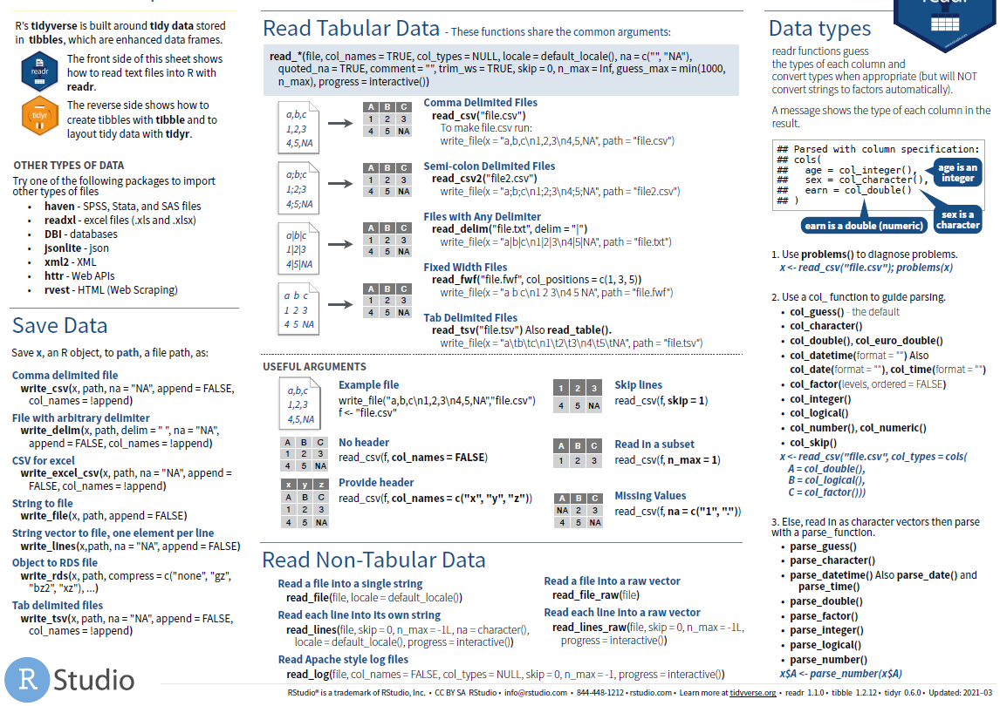
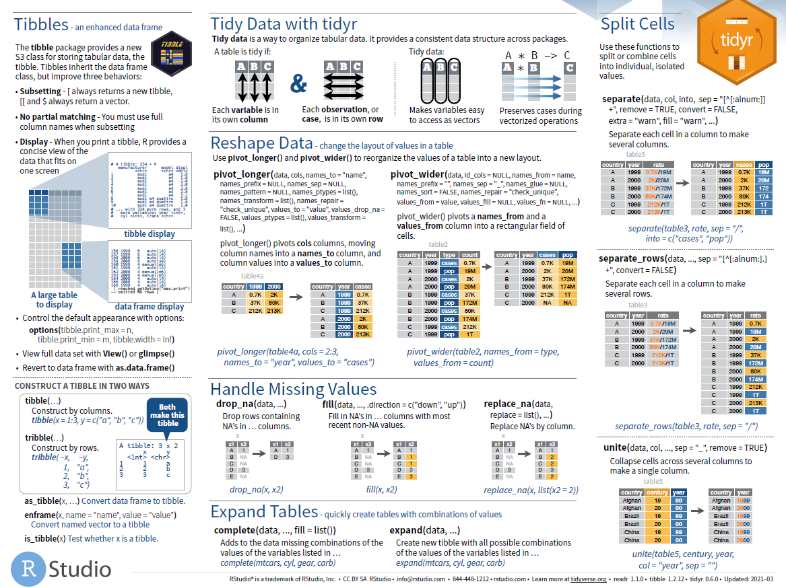
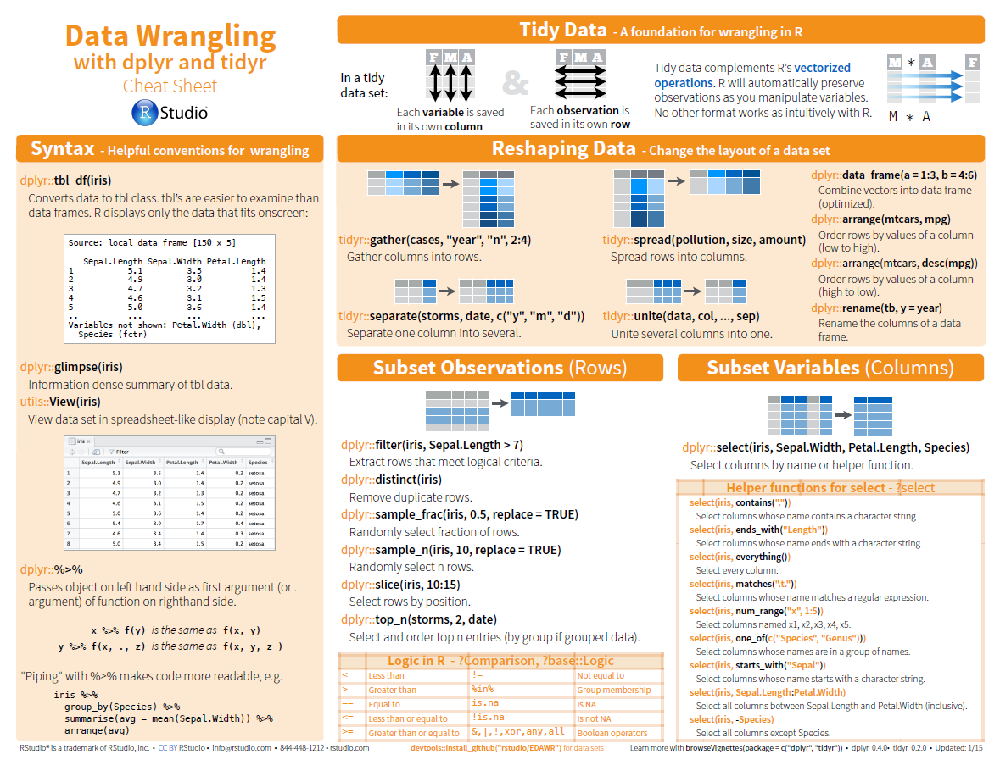
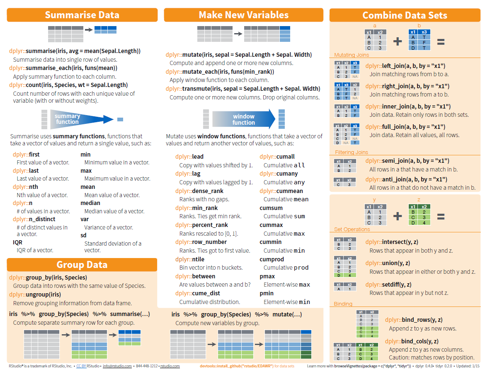
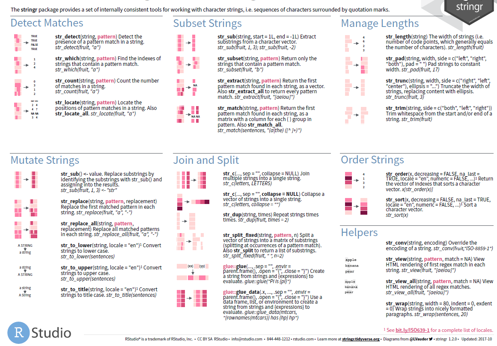

# Data Management using R


## Basic data management

### apply family


## import/imput

### Package readr 


```{r readr, echo=FALSE, fig.align="center", out.width = '100%',fig.cap="Data Import: CHEAT SHEET"}
 
 
```


### Import csv data

The Scan function returns a **list or vector**. This makes the scanning function less useful for entering "rectangular" data

```
mydata1 <- read.csv("~/Desktop/SASUniversityEdition/myfolders/Daten/CRP.csv",
                    sep=";", 
                    header=TRUE)   
mydata2 <- scan("~/Desktop/SASUniversityEdition/myfolders/Daten/CRP.csv", 
                sep=";", 
                what = list("integer","numeric"))
```

### Import txt data

```
test.semi <- read.table("https://stats.idre.ucla.edu/wp-content/uploads/2016/02/testsemicolon.txt", header=T, sep=";")
print(test.semi)

pfad <- "~/Desktop/SASUniversityEdition/myfolders/Daten"
mydata3 <- read.table(file.path(pfad, "CRP.csv"), 
                      header=TRUE, sep=";", dec = ",", skip=9) 
```

### Import excel data

* read.xlsx slow for large data sets (worksheet with more than 100 000 cells)  
* read.xlsx2 is faster on big files compared to read.xlsx function.

```
## install.packages("xlsx")
library("xlsx")
read.xlsx(file, sheetIndex, header=TRUE, colClasses=NA)
read.xlsx2(file, sheetIndex, header=TRUE, colClasses="character")
```

### Import stata data

```
library(foreign)
test.stata <- read.dta("https://stats.idre.ucla.edu/stat/data/test.dta")
print(test.stata)
```

### Import SAS data

```
library(sas7bdat)
data <- read.sas7bdat("~/Desktop/SASUniversityEdition/myfolders/Daten/uis.sas7bdat")
View(data)
```

### Copy from clipboard

```
copdat <- read.delim("clipboard")
yourdata <- copdat 
```

### Save and write objective in R

#### Save as R-Datei

```
path <- "C:/Users/zbai/Projects/00_Project/00 PMS_VENUS/VENUS_CIR/01_Datasets"
saveRDS(save_objective, file = file.path(path, "dataname.rds" ))

save_objective <- readRDS(file = file.path(path, "dataname.rds" ))
```

#### write.table and write.csv

```
#  quote：字符串是否使用引号表示，默认为TRUE，也就是使用引号表示
#  row.names：是否导出行序号，默认为TRUE，也就是导出行序号 
#  col.names：是否导出列名，默认为TRUE，也就是导出列名 
#  sep：分隔符，默认为空格（” “），也就是以空格为分割列
write.table (data ,file ="~/Desktop/f.csv", row.names = FALSE, col.names =FALSE, quote =FALSE)
```

#### write.foreign

Save as SPSS- und SAS- Datei 

```
library("foreign")
datafile <- tempfile()
codefile <- tempfile()
write.foreign(esoph, datafile, codefile, package="SAS")
file.show(datafile)
file.show(codefile)
unlink(datafile)
unlink(codefile)
```

#### write.xlsx

```
# Write the first data set in a new workbook
write.xlsx(USArrests, file = "./01_Datasets/myworkbook.xlsx",
      sheetName = "USA-ARRESTS", append = FALSE)
# Add a second data set in a new worksheet
write.xlsx(mtcars, file = "myworkbook.xlsx", 
           sheetName="MTCARS", append=TRUE)
# Add a third data set
write.xlsx(iris, file = "myworkbook.xlsx",
           sheetName="IRIS", append=TRUE)
```


### Save the plot

File formats for exporting plots:

* pdf(“rplot.pdf”): pdf file
* png(“rplot.png”): png file
* jpeg(“rplot.jpg”): jpeg file
* postscript(“rplot.ps”): postscript file
* bmp(“rplot.bmp”): bmp file
* win.metafile(“rplot.wmf”): windows metafile

```
# 1. Open a pdf file
pdf("rplot.pdf") 
# 2. Create a plot
plot(x = my_data$wt, y = my_data$mpg,
     pch = 16, frame = FALSE,
     xlab = "wt", ylab = "mpg", col = "#2E9FDF")
# 3. Close the pdf file
dev.off() 
```


## Package tidyr 

### CHEAT SHEET

```{r tidyr-cheat-sheet, echo=FALSE, fig.align="center", out.width = '100%',fig.cap="Data Wrangling with dplyr and tidyr"}


```


### Pivoting

* One variable might be spread across multiple columns. 
* One observation might be scattered across multiple rows. 
    + `pivot_longer()`
    + `pivot_wider()`
    
```{r pivot_longer,echo = T,message = FALSE, error = FALSE, warning = FALSE}
library("tidyr")
table4a

table4a %>% 
  pivot_longer(c(`1999`, `2000`), names_to = "year", values_to = "cases")
```

```{r pivot_wider, echo = T,message = FALSE, error = FALSE, warning = FALSE}
table2

table2 %>%
    pivot_wider(names_from = type, values_from = count)


## missing values
## last observation carried forward
treatment <- tribble(
  ~ person,           ~ treatment, ~response,
  "Derrick Whitmore", 1,           7,
  NA,                 2,           10,
  NA,                 3,           9,
  "Katherine Burke",  1,           4
)

treatment %>% 
  fill(person)
```

### gather and spread


```{r gather spread,echo = T,message = FALSE, error = FALSE, warning = FALSE}
## prepare data
olddata_wide <- read.table(header=TRUE, text='
 subject sex control cond1 cond2
       1   M     7.9  12.3  10.7
       2   F     6.3  10.6  11.1
       3   F     9.5  13.1  13.8
       4   M    11.5  13.4  12.9
')
olddata_wide$subject <- factor(olddata_wide$subject)

olddata_long <- read.table(header=TRUE, text='
 subject sex condition measurement
       1   M   control         7.9
       1   M     cond1        12.3
       1   M     cond2        10.7
       2   F   control         6.3
       2   F     cond1        10.6
       2   F     cond2        11.1
       3   F   control         9.5
       3   F     cond1        13.1
       3   F     cond2        13.8
       4   M   control        11.5
       4   M     cond1        13.4
       4   M     cond2        12.9
')
olddata_long$subject <- factor(olddata_long$subject)

## factor_key将新键列视为一个因子（而不是字符向量）
data_long <- gather(olddata_wide, condition, measurement, control:cond2, factor_key=TRUE)

##########################################################
#                     Äquivalent                         #
keycol <- "condition"                                    #
valuecol <- "measurement"                                #
gathercols <- c("control", "cond1", "cond2")             #
gather_(olddata_wide, keycol, valuecol, gathercols)      #
##########################################################

data_wide <- spread(data=olddata_long, key = condition, value = measurement, convert = T)
data_wide %>% str
```

### separate and unite


```{r separate unite ,echo = T,message = FALSE, error = FALSE, warning = FALSE}
table3

table3 %>% 
  separate(rate, into = c("cases", "population"), sep = "/")

table3 %>% 
  separate(year, into = c("century", "year"), sep = 2)

table5 %>% 
  unite(new, century, year)

table5 %>% 
  unite(new, century, year, sep = "")
```


## Package dplyr 

[Package ‘dplyr’](https://cran.r-project.org/web/packages/dplyr/dplyr.pdf)

### CHEAT SHEET

```{r dplyr-cheat-sheet, echo=FALSE, fig.align="center", out.width = '100%',fig.cap="Data Transformation with dplyr"}
knitr::include_graphics("./02_Plots/data_transformation1.png")
knitr::include_graphics("./02_Plots/data_transformation2.png")
```


### across


```{r across function,echo = T,message = FALSE, error = FALSE, warning = FALSE}
library("dplyr")
iris %>%
    as_tibble() %>%
    mutate(across(c(Sepal.Length, Sepal.Width), round))
```

### arrange


```{r arrange function,echo = T,message = FALSE, error = FALSE, warning = FALSE}
## Missing values are always sorted at the end:
data("flights",package="nycflights13")
arrange(flights, year, month, day)

## in descending order:
arrange(flights, desc(dep_delay))

## group_by
by_cyl <- mtcars %>% group_by(cyl)    
## 无视之前的分组            
by_cyl %>% arrange(desc(wt))    
   
## 在之前的分组内再排序    
by_cyl %>% arrange(desc(wt), .by_group = TRUE) 
```

### coalesce

```{r coalesce function,echo = T,message = FALSE, error = FALSE, warning = FALSE}
# Or match together a complete vector from missing pieces
y <- c(1, 2, NA, NA, 5)
z <- c(NA, NA, 3, 4, 5)
coalesce(y, z)

# Supply lists by with dynamic dots
vecs <- list(
  c(1, 2, NA, NA, 5),
  c(NA, NA, 3, 4, 5)
)
coalesce(!!!vecs)
```

### filter

```{r filter function,echo = T,message = FALSE, error = FALSE, warning = FALSE}
data("flights",package="nycflights13")
filter(flights, month == 1, day == 1)
filter(flights, month == 11 | month == 12)
filter(flights, month %in% c(11, 12))    

## Missing values,use is.na(x)
df <-  tibble(x = c(1, NA, 3))
filter(df, is.na(x) | x > 1) 
```

### if_else


```{r if_else function,echo = T,message = FALSE, error = FALSE, warning = FALSE}
x <- factor(sample(letters[1:5], 10, replace = TRUE))
ifelse(x %in% c("a", "b", "c"), x, factor(NA))
## 与ifelse不同，if_else保留类型
if_else(x %in% c("a", "b", "c"), x, factor(NA))
```

### join


```{r join function,echo = T,message = FALSE, error = FALSE, warning = FALSE}
## left join: 共有
## full join: 全部
## left join: 以左边为主

## 选取变量 left join
data("flights",package="nycflights13")
data("airlines",package="nycflights13")
data("weather",package="nycflights13")

flights2 <- flights %>% 
  select(year:day, hour, origin, dest, tailnum, carrier)
head(flights2)  
```


### mutate

```{r mutate function,echo = T,message = FALSE, error = FALSE, warning = FALSE}
## mutate()
flights_sml <- select(flights, 
  year:day, 
  ends_with("delay"), 
  distance, 
  air_time
) 
```


### select

```{r select function,echo = T,message = FALSE, error = FALSE, warning = FALSE}
data("flights",package="nycflights13")
select(flights, year, month, day)
select(flights, year:day)
select(flights, -(year:day))

    ## 辅助函数 helper functions can use within select():
       ## starts_with("abc"): matches names that begin with “abc”.
       ## ends_with("xyz"): matches names that end with “xyz”.
       ## contains("ijk"): matches names that contain “ijk”.
       ## num_range("x", 1:3): matches x1, x2 and x3.
    ## ignore.case选项表示忽略大小写。
select(iris, contains("etal", ignore.case = TRUE))

    ## 将几个变量移到数据框的开头
select(flights, time_hour, air_time, everything())

    ## rename
rename(flights, tail_num = tailnum)
```


### summarise

```{r summarise function,echo = T,message = FALSE, error = FALSE, warning = FALSE}
## with group_by
by_day <- group_by(flights, year, month, day)
summarise(by_day, delay = mean(dep_delay, na.rm = TRUE))


## pipe, %>%:
delays <- flights %>% 
  group_by(dest) %>% 
  summarise(
    count = n(),
    dist = mean(distance, na.rm = TRUE),
    delay = mean(arr_delay, na.rm = TRUE)
  ) %>% 
  filter(count > 20, dest != "HNL")
delays


## 进行任何汇总时，最好都包含一个计数（n（））或一个非缺失值的计数
## count=n(),
## non_miss=sum(!is.na(arr_delay)),

## quo()函数来求多值, “!!!”是引用终值并解析操作符，使用对象为元素为引用的列表或向量，它将引用的表达式解析并计算，每个列表元素都释放为summarize()函数的参数。另有“!!”操作符针对非列表对象
data("cuckoos", package = "DAAG")
var <- list(quo(mean(length)), quo(sd(length)),
            quo(mean(breadth)), quo(sd(breadth)))
cuckoos %>%
  group_by(species) %>%
  summarise(!!! var)
  
## Äquivalent
cuckoos %>%
  group_by(species) %>%
  summarise(mw_length = mean(length),
            mw_breadth = mean(breadth)) %>%
  arrange(mw_length, mw_breadth)
```


## Package stringr

### CHEAT SHEET

```{r stringr, echo=FALSE, fig.align="center", out.width = '100%',fig.cap="strings with stringr: CHEAT SHEET"}
 
knitr::include_graphics("./02_Plots/stringr_sheet2.png") 
```

## Package forcats

### CHEAT SHEET

```{r forcats, echo=FALSE, fig.align="center", out.width = '100%',fig.cap="Factors with forcats: CHEAT SHEET"}
knitr::include_graphics("./02_Plots/forcats_sheet1.png") 
```


## Package lubridate

### CHEAT SHEET

```{r lubridate, echo=FALSE, fig.align="center", out.width = '100%',fig.cap="Dates and times with lubridate: CHEAT SHEET"}
knitr::include_graphics("./02_Plots/lubridate_sheet1.png")
knitr::include_graphics("./02_Plots/lubridate_sheet2.png")
```

